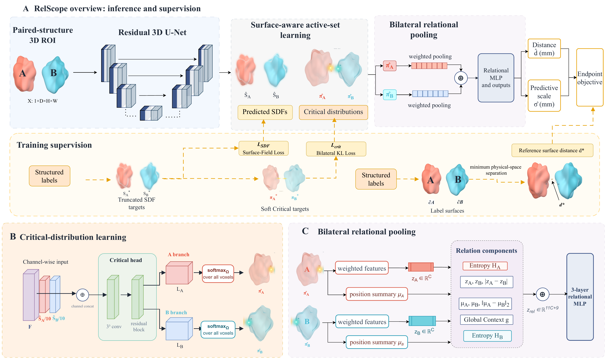

# RelScope

RelScope learns the boundary regions that govern a prespecified local measurement of two structured predictions. The reported implementation predicts truncated signed distance fields (SDFs), bilateral critical distributions, a physical distance, and a case-dependent scale from a structure-centred 3D image crop.

This repository accompanies **“Learning measurement-critical geometry beyond global segmentation accuracy for reliable 3D anatomical quantification.”** The manuscript-facing method name is **RelScope**. The Python package and checkpoint-compatible class retain the development name `relmeasure3d.PublicationRelMeasure3D`.

## Why RelScope?

Global segmentation quality is an imperfect surrogate for a measurement governed by a small local part of a boundary. RelScope therefore learns two complementary objects for a predefined anatomical relation:

1. continuous surface fields for the paired structures; and
2. bilateral critical distributions that localize the regions controlling their distance.

The distributions pool local features from both structures into a relation representation, from which the model predicts distance and a case-dependent scale. Each relation is trained with its own checkpoint; the released implementation is not a multi-query model.

```text
3D relation crop → residual 3D U-Net → surface fields + critical distributions
                 → bilateral relational pooling → distance + scale
```

## Method overview



Figure 2 summarizes the relation-specific inference path, target construction,
critical-distribution learning, and bilateral relational pooling used by the
reported model. An accompanying
[interactive surface generator](docs/figure2_drawing_helper/relscope_figure_surface_generator.html)
is included as an auxiliary drawing tool for constructing generic paired
surfaces, SDF-style fields, critical regions, and pooling illustrations. It is
not part of model training or inference and does not display patient data.

## Repository contents

```text
src/relmeasure3d/              model, geometry, data, losses, and segmentation baselines
scripts/train.py               training entry point used by the reported experiments
scripts/evaluate.py            relation- and patient-level measurement evaluation
scripts/preprocess_relations.py 3D ROI, SDF, and critical-target construction
scripts/analyze_*.py           proxy and critical-localization analyses
scripts/evaluate_measurement_uncertainty.py
                              ranking and split-conformal evaluation
configs/patterns_experiments.json
                              frozen experiment protocol
splits/                        released patient splits and path-portable relation indices
results/                       machine-readable manuscript statistics
tests/                         geometry, model, and split checks
docs/figure2_drawing_helper/   Figure 2 preview and auxiliary drawing tool
```

The repository does not redistribute medical images, preprocessing caches, checkpoints, or training logs. Dataset access remains governed by the original providers.

## Installation

Python 3.11 and a CUDA-enabled PyTorch installation are recommended for training.

```bash
python -m venv .venv
source .venv/bin/activate
python -m pip install --upgrade pip
python -m pip install -e '.[baselines,visualization,dev]'
```

The core package depends on NumPy, SciPy, NiBabel, pandas, scikit-image, PyTorch, and tqdm. The `baselines` extra installs MONAI and `dynamic-network-architectures` for the segmentation comparisons.

## Data preparation

The released relation indices store image and label paths relative to each dataset root. For example:

```bash
python scripts/preprocess_relations.py \
  --index splits/tooth_ian/relation_index.json \
  --dataset-root /path/to/ToothFairy3/extracted \
  --output work/tooth_ian_cache \
  --max-samples 3605 \
  --workers 6 \
  --size 96 \
  --spacing-mm 0.3 \
  --truncate-mm 10 \
  --delta-mm 1 \
  --center-mode tooth_centroid
```

The preprocessing output is an NPZ relation cache. Each record contains a normalized image crop, two structure masks, two truncated SDF targets, two soft critical targets, the reference distance in millimetres, and a sample identifier.

## Train RelScope

The command below reproduces the reported tooth–IAN optimization protocol for one seed. The other settings use the crop and batch values in `configs/patterns_experiments.json`.

```bash
python scripts/train.py \
  --data work/tooth_ian_cache \
  --split-json splits/tooth_ian/split.json \
  --output runs/tooth_ian/relscope_seed20260821 \
  --model publication_relmeasure \
  --base 16 \
  --steps 14000 \
  --batch-size 4 \
  --workers 8 \
  --lr 0.0002 \
  --seed 20260821 \
  --critical-weight 0.30 \
  --surface-weight 0.20 \
  --critical-warmup-steps 6000 \
  --validate-every 400 \
  --early-stop-patience 10 \
  --save-every 400 \
  --crop-size 80 \
  --crop-jitter-voxels 8
```

Direct regression uses the same split, optimizer, seed, and training budget:

```bash
python scripts/train.py \
  --data work/tooth_ian_cache \
  --split-json splits/tooth_ian/split.json \
  --output runs/tooth_ian/direct_seed20260821 \
  --model publication_direct \
  --base 16 \
  --steps 14000 \
  --batch-size 8 \
  --workers 8 \
  --lr 0.0002 \
  --seed 20260821 \
  --validate-every 400 \
  --early-stop-patience 10 \
  --save-every 400 \
  --crop-size 80 \
  --crop-jitter-voxels 8
```

## Evaluate measurements

```bash
python scripts/evaluate.py \
  --data work/tooth_ian_cache \
  --split-json splits/tooth_ian/split.json \
  --direct-checkpoint runs/tooth_ian/direct_seed20260821/latest.pt \
  --refined-checkpoint runs/tooth_ian/relscope_seed20260821/latest.pt \
  --direct-model publication_direct \
  --refined-model publication_relmeasure \
  --base 16 \
  --crop-size 80 \
  --splits validation calibration test \
  --include-rows \
  --output runs/tooth_ian/evaluation_seed20260821.json
```

Additional scripts reproduce the controlled perturbation, segmentation-measurement mismatch, critical localization, uncertainty, efficiency, cross-validation, and manuscript-statistics analyses. Their inputs are explicit command-line arguments; no server-specific paths are embedded in the released code.

## Released statistics and splits

- `results/patterns_unified_statistics.json` is the aggregate machine-readable source for the manuscript tables and effect estimates.
- `results/patterns_patient_statistics.csv` contains the patient-level summaries used for paired effects.
- `splits/` contains patient-level partitions, the five tooth–sinus folds, and relation indices with dataset-relative paths.
- `configs/patterns_experiments.json` records the seeds, optimization schedule, crop sizes, batch sizes, loss weights, and validation-selected segmentation pipelines.

See [docs/REPRODUCIBILITY.md](docs/REPRODUCIBILITY.md) for the end-to-end order and [docs/DATA.md](docs/DATA.md) for dataset layout assumptions.

## Evaluation settings

| Public dataset | Anatomical relation | Role in the study |
|---|---|---|
| ToothFairy3 | Tooth–inferior alveolar nerve | Primary in-domain and scanner hold-out evaluation |
| ToothFairy3 | Tooth–maxillary sinus | Fixed test and 5-fold × 3-seed out-of-fold evaluation |
| TotalSegmentator v1 | Pancreas–aorta | Additional in-domain setting and source domain for locked transfer |
| AMOS22 | Pancreas–aorta | Additional in-domain setting and target domain for locked transfer |
| Medical Segmentation Decathlon Task08 | Tumour–hepatic vessel | Contact-dominated applicability-boundary setting |

## Citation

The article citation will be added after publication. Until then, cite this repository using `CITATION.cff` and the manuscript title above.

## License

The code is released under the MIT License. Dataset files remain subject to their original licenses and terms of use.
